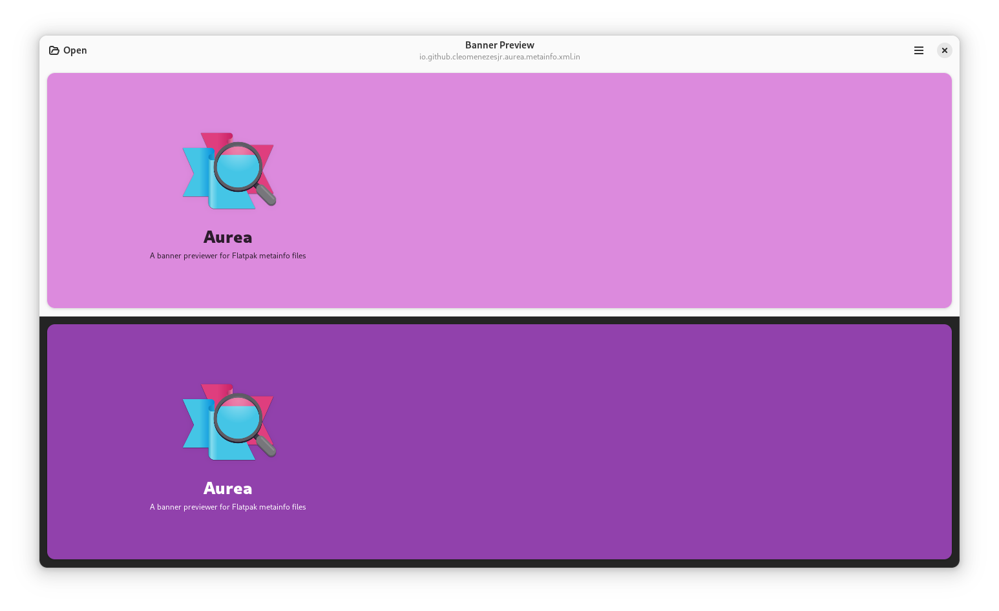

<h1 align="center">
  
  <br>
  Aurea
</h1>

<p align="center">Aurea is a simple preview banner made to read metainfo files from Flatpak apps and represent them as they would on Flathub.</p>

<p align="center">
  </a>
</p>

## Build

#### We need the following resources:

- org.gnome.Sdk
- flatpak-builder

#### Clone, build and run:

Clone the latest Aurea source from GitHub

```bash
git clone https://github.com/CleoMenezesJr/Aurea.git
```

Enter the directory and build

```bash
cd Aurea
flatpak-builder build io.github.cleomenezesjr.aurea.json --user --install --force-clean
```

Run

```bash
cd Aurea
flatpak run io.github.cleomenezesjr.aurea
```

That's it!

## I want to create a pot file!

You can use this command to create a pot file for translation:

`xgettext --files-from=po/POTFILES --output=po/aurea.pot --from-code=UTF-8 --add-comments --keyword=_ --keyword=C_:1c,2`

## I want to participate in the community!
Join [Aurea's room](https://matrix.to/#/%23aurea-app:matrix.org) at Matrix to ask questions and be part of the community.
